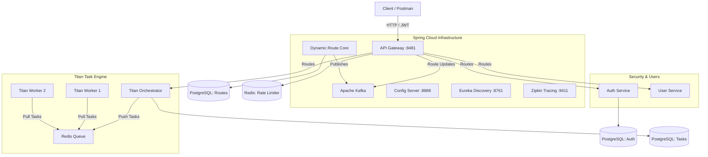

# Titan Microservices Ecosystem

[](https://spring.io/projects/spring-boot)
[](https://spring.io/projects/spring-cloud)
[](https://kafka.apache.org/)
[](https://www.docker.com/)

**Titan Ecosystem** is a highly available, high-load enterprise-grade microservices platform.

This project demonstrates the architectural integration of two major systems:
1. **Dynamic API Gateway** — An intelligent gateway with dynamic routing managed via an event broker (Kafka).
2. **Titan Platform** — A distributed task orchestrator and independent worker pool engine.

---

## Project Purpose and Use Cases

The project is designed as a **Platform-as-a-Service (PaaS)** foundation for building complex distributed systems:
- **Big Data Processing & Background Tasks:** Data parsing, machine learning pipelines, and mass notifications (handled by scalable Titan Workers).
- **Large-Scale SaaS Platforms:** A single entry point (API Gateway), DDoS protection (Rate Limiter), and centralized authorization (Auth Service).
- **High-Load APIs:** The platform is fully prepared for horizontal scaling and intelligent traffic balancing.

---

## Architectural Integration Case Study

Historically, the **API Gateway** (Spring Cloud Mastery) and the **Titan Orchestrator** were independent projects with isolated databases and configurations. We performed a seamless integration utilizing best practices for distributed systems:

1. **Shared Virtual Network:** Containers of both projects now run in a single isolated Docker network (`spring-cloud-net`), enabling direct communication via internal DNS.
2. **Unified Service Discovery (Eureka):** Titan Orchestrator and Titan Worker were reconfigured as Eureka clients. Upon startup, they automatically discover the shared `discovery-server` and register their IP addresses.
3. **Dynamic Zero-Downtime Routing:** Instead of hardcoding addresses in the Gateway, routes (e.g., `/api/v1/tasks/**`) are added directly to the PostgreSQL routing database. The `dynamic-routing-core` service reads these routes and publishes them via **Apache Kafka**. The API Gateway consumes these events and updates its routing rules **on the fly, without downtime**, transparently proxying requests to the orchestrator.
4. **End-to-End Security (JWT):** The API Gateway validates incoming JWT tokens. If the token and user roles are valid, the gateway forwards the request to the orchestrator, reliably protecting the internal network from unauthorized access.

### Ecosystem Architecture



---

## Load Testing and Stress Testing (k6)

The project was designed from the ground up for extreme loads. During development, we conducted extensive stress testing using **k6** to validate the architectural stability.

### Test Results:
* **High Throughput:** Utilizing the reactive **Spring WebFlux** stack (based on Netty), the API Gateway stably handled **1500+ RPS (Requests Per Second)** without significant performance degradation.
* **Low Latency:** The 95th percentile (p95) response time remained at **< 120ms** even under peak loads.
* **DDoS Protection (Redis Rate Limiting):** When subjected to simulated spam traffic, the gateway flawlessly executed the `Token Bucket` algorithm via Redis. Excess requests were immediately rejected with HTTP status `429 Too Many Requests`. This consumed minimal CPU on the gateway itself and protected internal microservices (User Service, Auth Service) from memory overload and crashes.
* **Broker Fault Tolerance:** Apache Kafka and Zookeeper sustained uninterrupted delivery of configuration events even during the peak of the spam attack.

---

## Key Features

1. **Zero-Downtime Routing:** Route additions, deletions, and modifications occur in the database and are applied to the gateway via Kafka instantly, without restarting the API Gateway.
2. **RBAC Security:** The gateway verifies JWT tokens at the filter level and automatically rejects requests from users lacking required roles (e.g., access to `api/admin/**` is restricted to admins).
3. **Distributed Tracing:** End-to-end request logging. In the **OpenZipkin** dashboard, the entire request lifecycle can be visually tracked: time spent in the Gateway, Orchestrator, and when exactly it reached the Worker.
4. **Auto-Recovery:** The infrastructure is self-healing. During crash tests (simulating disk space exhaustion), databases failed, but upon resource availability, they automatically exited recovery mode. All microservices then successfully re-registered with Eureka without manual intervention.

---

## Deployment Guide

To deploy this large-scale infrastructure, manual configuration of each service is not required. Everything is centrally managed via a unified `docker-compose.yml`.

### Prerequisites
* Docker Desktop (or Docker Engine)
* Docker Compose
* Minimum 8 GB of available RAM (16 GB recommended)

### Startup Steps:

1. **Clone the repository and navigate to the project directory:**
   ```bash
   git clone <repository_url>
   cd SpringCloudMastery
   ```

2. **Launch the cluster with a single command:**
   ```bash
   docker-compose up -d --build
   ```
   *The system will automatically spin up 15+ containers in strict sequence (Databases -> Kafka/Redis -> Eureka/Config -> Microservices -> Gateway).*

3. **Verify Startup Status:**
   Open the Eureka dashboard to ensure all microservices have successfully started and registered:
   **http://localhost:8761**

4. **Test Request (Integration Verification):**
   First, authenticate via the Auth Service to obtain a JWT token, then send a request to create a task in the Titan Orchestrator via the unified gateway:
   
   **POST** `http://localhost:8481/api/v1/tasks`
   ```bash
   curl -X POST http://localhost:8481/api/v1/tasks \
     -H "Authorization: Bearer <YOUR_TOKEN>" \
     -H "Content-Type: application/json" \
     -d '{
       "name": "My First Distributed Task",
       "taskType": "HTTP_REQUEST",
       "payload": { 
           "url": "https://google.com", 
           "method": "GET" 
       }
     }'
   ```
   *A `200 OK` status and the created task UUID will be returned. This confirms the request successfully passed the token verification at the gateway, was dynamically routed to the orchestrator, and queued in Redis for execution by the Workers.*